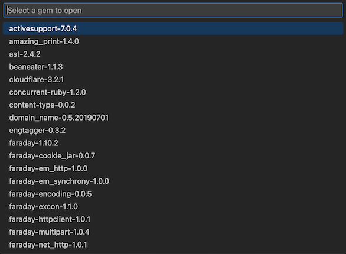

# Ruby Open Gem for VS Code

This extension adds a **"Ruby Open Gem"** command for Ruby projects in VSCode. It scans your Gemfile with bundler and then opens the gem source in a new VS Code window. Handy!

## Incredible Screenshot

## Caveats and Troubleshooting

Ruby Open Gem relies on bundler to list gems. Investigate `bundle check` and `bundle list --paths` in your project if you can't get it to work.

## Changelog

#### 0.1.0 - Feb 2023

- Initial release

## License

This extension is [licensed under the MIT License](LICENSE.txt).
